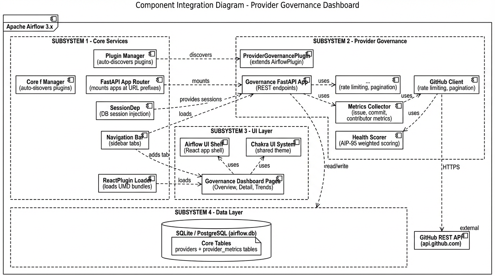
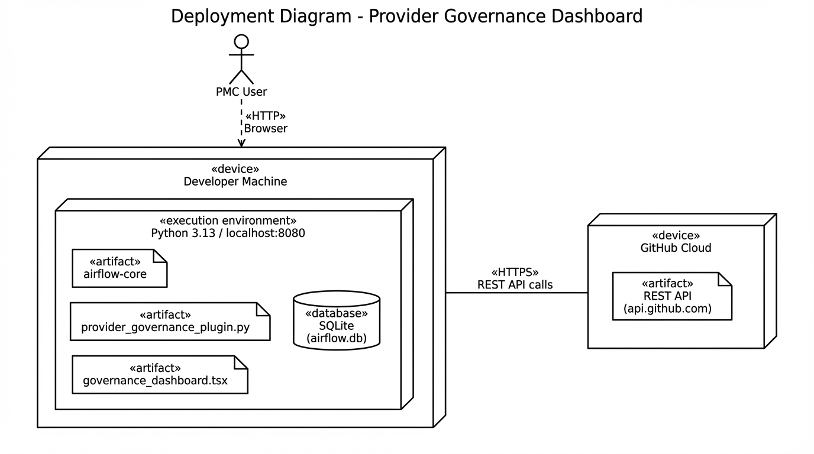
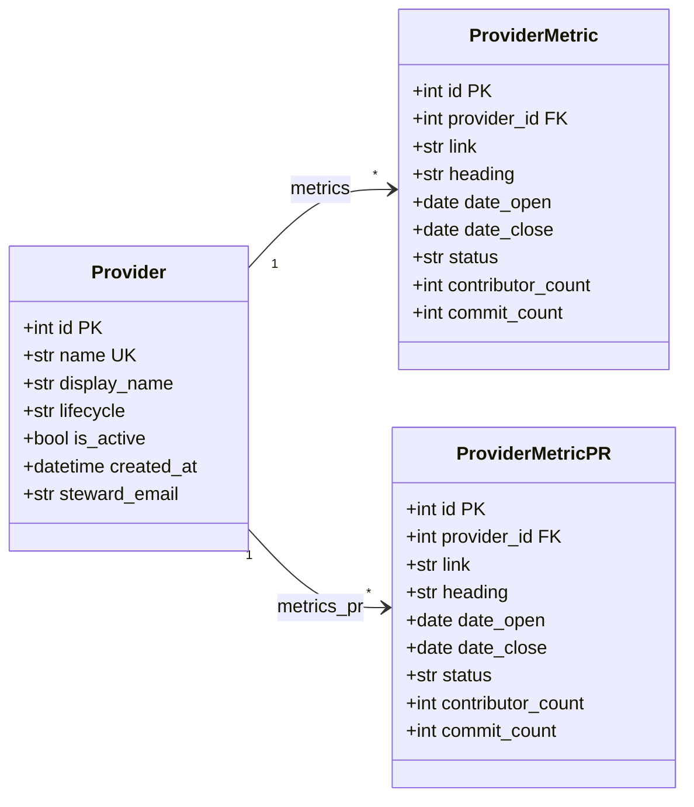
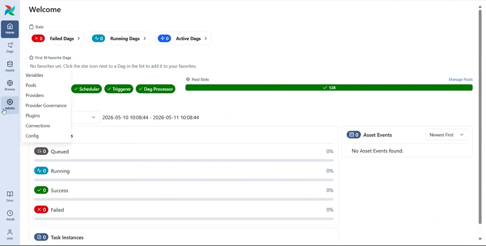
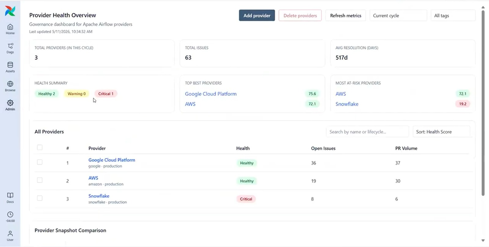
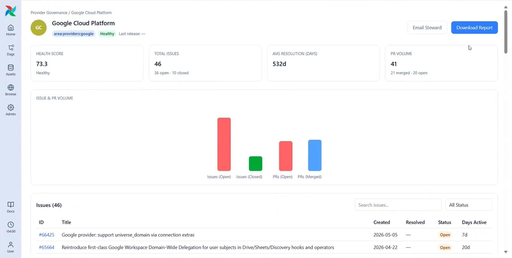
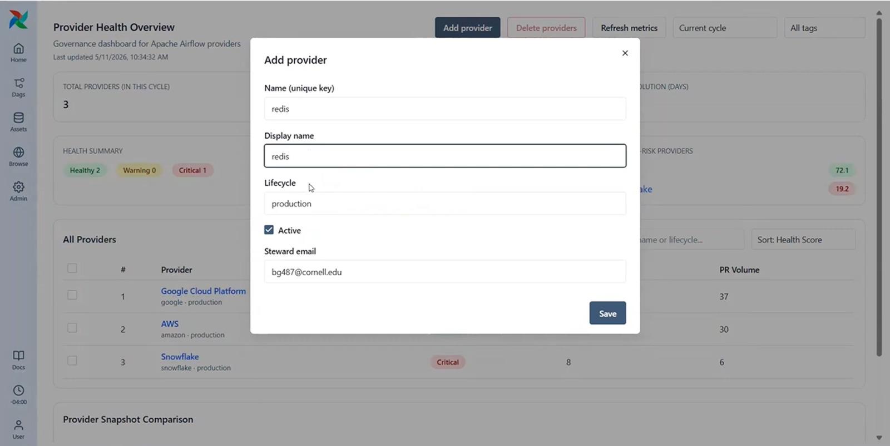
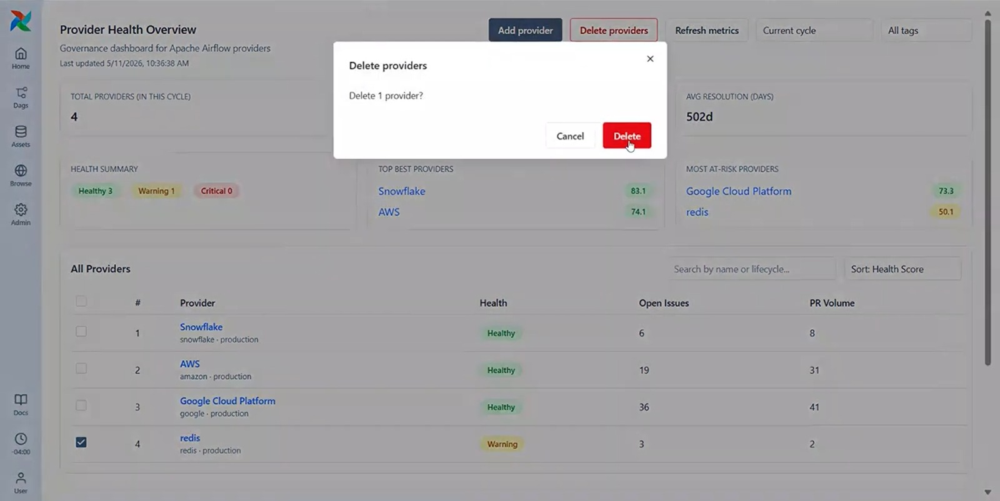

# Provider Governance — Maintainer’s Manual

This folder is the **handoff bundle** for the Provider Governance feature: system design, implementation history, local development, testing, and operational notes. Paths to source and tests are relative to the **repository root** (parent of `provider-governance-handoff/`).

## Table of contents

### This manual

| Section | Description |
|---------|-------------|
| [Contents of this folder](#contents-of-this-folder) | Sibling Markdown in this folder; static diagrams live under `../diagrams/` (**§3**–**§4**) |
| [1. Requirements (maintainer view)](#1-requirements-maintainer-view) | Scope, in/out of scope, pointers to formulas |
| [2. System design (summary)](#2-system-design-summary) | Link to draft architecture doc; canonical code paths table |
| [3. Architectural diagrams (static assets)](#3-architectural-diagrams-static-assets) | Three PNG diagrams + UI shots; Mermaid ORM class diagram |
| [4. User interface (as built)](#4-user-interface-as-built) | Routes, behavior pointers, UI screenshots (`diagrams/ui/`) |
| [5. Style guide and developer workflow](#5-style-guide-and-developer-workflow) | UI/Python conventions, review |
| [6. Test plan and regression playbook](#6-test-plan-and-regression-playbook) | Commands, manual smoke, numeric baseline |
| [7. Deployment and operations](#7-deployment-and-operations) | Install, migrate, config, rollback |
| [8. Document drift policy](#8-document-drift-policy) | Order of updates when behavior changes |
| [Revision](#revision) | Handoff bundle layout note |

Outbound links to **source files** are collected in **§2**. Links to **Apache contributor docs** (`AGENTS.md`, `contributing-docs/`) appear under **Contents of this folder** and in **§5**.

---

## Contents of this folder

| Document | Purpose |
|----------|---------|
| **This file** | Single entry point: scope, design summary, workflow, testing, deployment pointers |
| [system-architecture.md](system-architecture.md) | Draft architecture narrative, MVP scope, component tables |
| [PROVIDER_GOVERNANCE_CHANGES.md](PROVIDER_GOVERNANCE_CHANGES.md) | Authoritative **as-built** changelog: routes, migrations, UI behavior, metric formulas |
| [PROVIDER_GOVERNANCE_TESTING_PLAN.md](PROVIDER_GOVERNANCE_TESTING_PLAN.md) | Test matrix, commands, numeric test counts, manual checklist, user-testing synthesis |
| [AIRFLOW-DEV-SETUP.md](AIRFLOW-DEV-SETUP.md) | Fork/clone, editable install, UI builds, `airflow standalone` (run commands from repo root) |

Apache-wide contributor setup (virtualenv, Breeze, prek) remains in the repo root: [AGENTS.md](../AGENTS.md) and [contributing-docs/](../contributing-docs/).

---

## 1. Requirements (maintainer view)

**Problem:** PMCs need repeatable visibility into provider maintenance signals (issues, PRs, activity) to support governance (e.g. AIP-95).

**In scope (as implemented):**

- Registry of tracked providers and persisted issue/PR rows synced from GitHub (`apache/airflow`).
- Aggregated summary metrics, health score, and admin UI: overview + per-provider detail (including **CSV report download** from the detail page).
- Ad-hoc refresh (no continuous real-time monitoring requirement in product docs).

**Out of scope** for this feature slice: deprecating providers automatically, non-GitHub hosts, multi-repo aggregation beyond this monorepo, and **SMTP-based steward alerts** (de-scoped; see Note in [PROVIDER_GOVERNANCE_CHANGES.md](PROVIDER_GOVERNANCE_CHANGES.md)).

**Functional detail and formulas:** see the **Components** table in [PROVIDER_GOVERNANCE_CHANGES.md](PROVIDER_GOVERNANCE_CHANGES.md), the closing **Note** (inline docs in `health_score.py` and `summary_metrics.py`), and [system-architecture.md](system-architecture.md) for draft context only (if narrative conflicts with code or migrations, code and [PROVIDER_GOVERNANCE_CHANGES.md](PROVIDER_GOVERNANCE_CHANGES.md) win).

---

## 2. System design (summary)

See [system-architecture.md](system-architecture.md) for the architecture narrative, draft diagrams, and component tables. Below are the **canonical repository paths** for maintainers (from the repository root).

| Layer | Path |
|-------|------|
| FastAPI UI routes | [`airflow-core/src/airflow/api_fastapi/core_api/routes/ui/provider_governance.py`](../airflow-core/src/airflow/api_fastapi/core_api/routes/ui/provider_governance.py) |
| GitHub sync + helpers | [`airflow-core/src/airflow/provider_governance/github_metrics.py`](../airflow-core/src/airflow/provider_governance/github_metrics.py), [`github_metric_derived.py`](../airflow-core/src/airflow/provider_governance/github_metric_derived.py) |
| Aggregation + health | [`summary_metrics.py`](../airflow-core/src/airflow/provider_governance/summary_metrics.py), [`health_score.py`](../airflow-core/src/airflow/provider_governance/health_score.py) |
| ORM models | [`airflow-core/src/airflow/models/provider_governance.py`](../airflow-core/src/airflow/models/provider_governance.py) |
| React pages | [`ProviderGovernance.tsx`](../airflow-core/src/airflow/ui/src/pages/ProviderGovernance.tsx), [`ProviderGovernanceDetail.tsx`](../airflow-core/src/airflow/ui/src/pages/ProviderGovernanceDetail.tsx) |
| Migrations | [`airflow-core/src/airflow/migrations/versions/`](../airflow-core/src/airflow/migrations/versions/) — search filenames for `provider_governance` |

**Auth / GitHub tokens:** document env vars in [PROVIDER_GOVERNANCE_CHANGES.md](PROVIDER_GOVERNANCE_CHANGES.md) (e.g. `GITHUB_TOKEN` / `AIRFLOW_PROVIDER_GOVERNANCE_GITHUB_TOKEN`).

---

## 3. Architectural diagrams (static assets)

Static diagrams live under [`../diagrams/`](../diagrams/). The **architecture** draft PNG is embedded in [system-architecture.md](system-architecture.md). **Component** and **deployment** PNGs are embedded in this section (below). **UI** JPEGs are embedded in [§4 — User interface](#4-user-interface-as-built).

| # | Diagram | File (from repo root) | Where embedded |
|---|---------|----------------------|----------------|
| 1 | **Architecture** (draft v1 — system context) | [`diagrams/architecture_diagram_v1.png`](../diagrams/architecture_diagram_v1.png) | [system-architecture.md](system-architecture.md) |
| 2 | **Component integration** | [`diagrams/component_diagram.png`](../diagrams/component_diagram.png) | This section (below) |
| 3 | **Deployment** | [`diagrams/deployment_diagram.png`](../diagrams/deployment_diagram.png) | This section (below) |

### Component integration diagram



### Deployment diagram



**UI (running app):** JPEGs under [`../diagrams/ui/`](../diagrams/ui/) — see [§4 — User interface](#4-user-interface-as-built).

These PNGs are **course / design artifacts**. When the product diverges, update the files or add a dated note in [PROVIDER_GOVERNANCE_CHANGES.md](PROVIDER_GOVERNANCE_CHANGES.md).

### ORM class diagram (SQLAlchemy)

High-level model for Provider Governance persistence ([`provider_governance.py`](../airflow-core/src/airflow/models/provider_governance.py)). Tables: `providers`, `provider_metrics` (issues), `provider_metrics_pr` (PRs); child rows cascade on provider delete.



For deeper behavior (sync, scoring), see **§2** and [PROVIDER_GOVERNANCE_CHANGES.md](PROVIDER_GOVERNANCE_CHANGES.md).

---

## 4. User interface (as built)

- **Routes:** `/provider-governance`, `/provider-governance/:providerId` (core UI router).
- **Behavior:** see [PROVIDER_GOVERNANCE_CHANGES.md](PROVIDER_GOVERNANCE_CHANGES.md) sections on overview, detail, refresh, delete provider, and Sprint 3 UI cleanup.

**UI screenshots** (from a running build; files live under [`diagrams/ui/`](../diagrams/ui/)):

**Admin entry — Provider Governance in the menu**



**Overview — provider health table and summary**



**Detail — single provider**



**Add provider**



**Delete provider**



When the UI changes materially, replace these images and keep filenames or update **§4** (and paths under `../diagrams/ui/`).

---

## 5. Style guide and developer workflow

- **UI:** Follow existing Airflow 3 UI patterns — Chakra components, patterns in neighboring admin pages. Do not introduce a parallel design system.
- **Python:** Match Airflow style, typing, and logging conventions; run **prek** / static checks per [AGENTS.md](../AGENTS.md).
- **Branches / review:** team convention (feature branches, merge to sprint branch) is described in course reports; align with Apache norms when contributing upstream.

---

## 6. Test plan and regression playbook

**Authoritative detail:** [PROVIDER_GOVERNANCE_TESTING_PLAN.md](PROVIDER_GOVERNANCE_TESTING_PLAN.md).

**Quick reproduction** (same commands as [PROVIDER_GOVERNANCE_TESTING_PLAN.md §9](PROVIDER_GOVERNANCE_TESTING_PLAN.md); from repository root unless noted):

1. **Python unit + API (Provider Governance)** — use a full dev environment ([AGENTS.md](../AGENTS.md), Breeze, or `uv sync` so `tests_common` and providers resolve):

   ```bash
   PYTHONPATH="devel-common/src:airflow-core/src:task-sdk/src" \
     uv run pytest \
     airflow-core/tests/unit/provider_governance \
     airflow-core/tests/unit/api_fastapi/core_api/routes/ui/test_provider_governance.py
   ```

   If imports fail, run the same targets inside **Breeze** (recommended for parity with CI).

2. **UI (Vitest)** — from `airflow-core/src/airflow/ui`:

   ```bash
   pnpm -s vitest run \
     src/pages/ProviderGovernance.load.test.tsx \
     src/pages/ProviderGovernance.refresh.test.tsx \
     src/pages/ProviderGovernance.filters.test.tsx \
     src/pages/ProviderGovernanceDetail.load.test.tsx \
     src/pages/ProviderGovernanceDetail.interactions.test.tsx
   ```

3. **Manual smoke:** follow **§5 — Manual End-to-End Checks** in [PROVIDER_GOVERNANCE_TESTING_PLAN.md](PROVIDER_GOVERNANCE_TESTING_PLAN.md).

4. **Optional line coverage** for governance modules: see **§9** in [PROVIDER_GOVERNANCE_TESTING_PLAN.md](PROVIDER_GOVERNANCE_TESTING_PLAN.md).

**Numeric regression baseline:** **§7 — Coverage Metrics Reported**, including the **Automated test counts** table (26 + 10 + 11 = **47**), in [PROVIDER_GOVERNANCE_TESTING_PLAN.md](PROVIDER_GOVERNANCE_TESTING_PLAN.md). Re-verify counts after adding or removing tests (`pytest --collect-only`, Vitest summary).

---

## 7. Deployment and operations

1. **Build / install:** [AIRFLOW-DEV-SETUP.md](AIRFLOW-DEV-SETUP.md) (local from source). For production-like environments, follow your platform’s Airflow packaging; this handoff does not replace official release docs.

2. **Database migrations:** after pulling code, run `airflow db migrate` (or your orchestration equivalent). Migration chain for this feature is listed in [PROVIDER_GOVERNANCE_CHANGES.md](PROVIDER_GOVERNANCE_CHANGES.md) (revisions `0105`–`0110` and related).

3. **Configuration:** ensure GitHub token env vars are set wherever sync runs; rate limits and failure surfaces are covered in the changes doc and API tests.

4. **Rollback:** use Alembic downgrade only with ASF/project policy; document any fork-specific rollback in your runbook.

---

## 8. Document drift policy

When behavior changes:

1. Update [PROVIDER_GOVERNANCE_CHANGES.md](PROVIDER_GOVERNANCE_CHANGES.md) first (routes, formulas, migrations).
2. Adjust [PROVIDER_GOVERNANCE_TESTING_PLAN.md](PROVIDER_GOVERNANCE_TESTING_PLAN.md) if commands or counts change.
3. Update this manual only if onboarding flow or high-level architecture narrative changes.
4. Refresh [system-architecture.md](system-architecture.md), **§3** static PNGs under `../diagrams/`, and **§4** / `../diagrams/ui/` if the **intended** architecture or UI picture changes.

---

## Revision

Handoff bundle layout introduced: single maintainer manual plus sibling artifacts in `provider-governance-handoff/`. Diagram image files remain under repository [`diagrams/`](../diagrams/) (including [`diagrams/ui/`](../diagrams/ui/) screenshots) with relative links from moved markdown.
